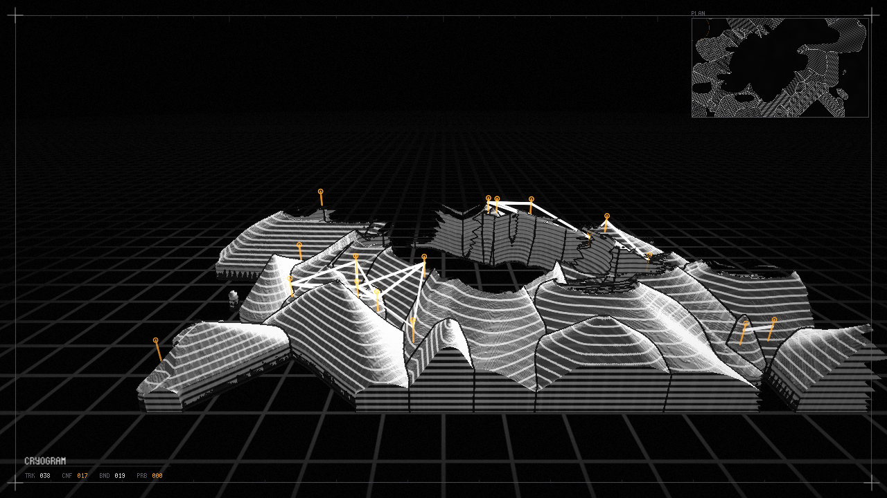

# CRYOGRAM

**An instrument that grows a crystal, measures it with the real Features node, extrudes the measurement into 3D, and lets you paint back into the growth.**



A modular chain of eight authored nodes, built entirely from custom Modules. Load `cryogram.sentinel` — all modules are bundled under `modules/`.

---

## Graph

```
cryo_crucible ──┬─ Structure ─→ cryo_proxy ─→ [features] ─→ cryo_tracker ─→ cryo_lattice ─┐
   (owns probes)│                480x270      cryo_detect        Tracks         Filaments │
                ├─ Field ────────────────────────────────────→ cryo_relief ←──────────────┤
                ├─ Specimen ─────────────────────────────────→ cryo_console ←─────────────┤
                └─ Probes ───────────────────────────────────→ cryo_program ←─────────────┘
```

| Node | Layer | Role |
| --- | --- | --- |
| `cryo_crucible` | SPECIMEN | Anisotropic solidification field. Owns authored probes. 3 outputs: Specimen / Structure / Field |
| `cryo_proxy` | MEASUREMENT | 480x270 analysis conditioning + island separation. 2 outputs: Analysis / Inspect |
| `cryo_detect` | MEASUREMENT | **The real `features` node** — blobs + corners |
| `cryo_tracker` | MEASUREMENT | Persistent identity with attack/release hysteresis |
| `cryo_lattice` | MEASUREMENT | Bonded structure over confirmed identities only |
| `cryo_relief` | INTERPRETATION | Raymarched 3D relief on the internal camera |
| `cryo_console` | INTERFACE | Canvas panel: plan stage, telemetry, tension gate, 3D witness |
| `cryo_program` | PRESENTATION | Final plate: halation, registration frame, live title block |

## The specimen is designed to be measurable

The first semantic node is an authored generator, not test imagery. It runs a real continuous-fraction cellular solidification model: liquid cells accrete solid fraction from solid neighbours, shaped by an n-fold anisotropy kernel evaluated against the **donor** cell's crystallographic orientation, so fronts facet instead of blobbing. Orientation and grain id lock at first contact, which is what makes grains coherent regions with hard boundaries.

Life cycle: nucleate → grow → hold → **resorb** (past `anneal_life`, oldest material first, so grains hollow from the inside) → liquid. Growth and resorption are mutually exclusive, so a dissolving grain cannot re-feed itself. This is why the piece breathes instead of saturating.

That structure is exactly what the measurement layer is built to detect: grains → regions, facet vertices and triple junctions → corners, boundaries → lines.

## Data-to-visual contract

| Measured | Drawn as |
| --- | --- |
| Corner, tracked across time | Persistent identity with stable id |
| Track confidence ≥ threshold | **Amber.** Warmth means the instrument is sure — it is a readout, not decoration |
| Track age | Age arc sweep; elevation in the relief |
| Bond length vs. measured lattice spacing | Stroke weight — compressed heavy, stretched fine |
| Grain boundary | Fault scarp in 3D, dark hairline in plan |
| Grain orientation | Crystallographic hatching, carried from specimen into the relief surface |

## Interaction

Nothing here duplicates a Properties slider. Numeric shaping stays in Properties.

**On the Crucible preview** (a click *is* a field coordinate — no fitted-stage remap, no unprojection):

- left click / drag — place or paint a probe
- right press — ANNEAL, without changing the current kind
- wheel — probe radius
- `C` — cycle SEED / ANNEAL / ANCHOR
- `X` — clear

| Probe | Effect on the specimen |
| --- | --- |
| **SEED** | Raises nucleation *and* biases the anisotropy kernel toward itself, so fronts visibly reach for it |
| **ANNEAL** | Forces solid fraction down — a melt brush |
| **ANCHOR** | Pins cell age below `anneal_life`, so material inside never resorbs |

**On the Console panel:** the GATE pad sets bond radius (X) against eligibility (Y) together, driving `cryo_lattice` through live `ref()` expressions. Two separate sliders cannot express that trade-off against a visible field.

## Findings worth keeping

Three things were established by measurement, not assumption:

1. **The Features blob task is not a strict connected-component labeler.** An independent labeler found 30 separated components in the exact 480x270 image where Features reported 4, with the largest blob's bbox spanning the whole frame. Blobs were therefore reassigned to *macro clusters* and **corners** became the primary record stream. Verify before building a data contract on top of a detector's assumed semantics.

2. **Cross-node feedback cycles are rejected** (`Cannot create link: type mismatch or cycle detected`). The loop closes by giving the *upstream* node ownership of the authored state and publishing it outward, rather than routing downstream state back in.

3. **The injected `hash21` collapses toward zero for large arguments** (pixel coords plus a time counter), which detonated nucleation into per-pixel noise. `cryo_crucible/grow.hlsl` carries an integer bit-mix hash instead.

Also load-bearing:

- Orientation must be inherited **exactly**. Per-cell jitter random-walks across a grain and decorrelates the hatch into static.
- Contours are an elevation reading and belong only on near-horizontal surfaces; on a vertical face the screen gradient collapses and every pixel qualifies. Steep faces get world-height bands instead.
- A grain-id difference threshold of `0.004` is one 8-bit step, so quantization alone trips it and speckles the surface.
- The proxy derives its source extent from `GetDimensions` and prints it (`1280x720 > 480x270`) rather than assuming `_Resolution`.

## Performance

Whole graph ~8 ms, no profiler hotspots. The Features corner task was the one real risk: at `quality 0.30 / min_distance 14` it cost **29 ms** and was flagged as a hotspot; at `quality 0.48 / min_distance 17` it delivers 39 corners for **2.0 ms**. Re-profile after any change to that node.

## Camera

`cryo_relief` uses Sentinel's internal camera (`features: [camera]`, `viewport.interactions: [camera]`, `camera_ref` empty, Fly mode). Terrain, bond wires, identity markers and depth-occlusion all derive from the same injected matrices. Note that `camera_yaw` / `camera_pitch` are in **radians**.
