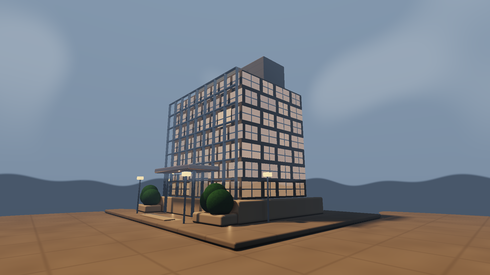

# Procedural Building System

This example is a modular, editable architectural construction system. It separates massing, facade generation, materials, lighting, rendering, and optional AI relighting into semantic nodes connected by typed data lanes.



## Open the project

Load `procedural_building_system.sentinel` in Sentinel 0.5.44 or newer. The five authored Modules resolve to the repository's root `modules/` directory through portable relative paths.

The procedural core requires no engine pack. `06 Detail and Relight` is optional and requires a compatible SDXL StreamDiff engine pack with ControlNet support.

## Graph architecture

```text
01 Building Massing ── PNodes ─────┬─> 02 Facade Generator ─ Facade Elements ─┐
                                   ├─> 04 Lighting Rig ───── Light Records ───┤
                                   └───────────────────────────────────────────┤
03 Material Library ─ Material Records ────────────────────────────────────────┤
                                                                                v
                                                        05 Architectural Renderer
                                                          ├─ sRGB Building ──> Video + Style
                                                          └─ Native Depth ───> Depth ControlNet
                                                                                v
                                                        06 Detail and Relight (optional)
```

| Node | Responsibility | Published contract |
| --- | --- | --- |
| `01 Building Massing` | Editable site, podium, tower, crown, canopy, and secondary volumes | 48-byte `PNodes` |
| `02 Facade Generator` | Expands building dimensions into windows and facade modules | 64-byte facade records |
| `03 Material Library` | Publishes twelve physically meaningful material definitions | 64-byte material records |
| `04 Lighting Rig` | Publishes sun, sky, practical, canopy, and path-light data | 64-byte light records |
| `05 Architectural Renderer` | Raymarches the shared records with one native camera owner | 8-bit sRGB color plus 8-bit native depth |
| `06 Detail and Relight` | Optional depth-conditioned architectural interpretation | StreamDiff color output |

## Interaction model

The Canvas panels are spatial editors, not duplicate Properties inspectors:

- Massing supports selection, move/rotate tools, snapping, panning, zooming, fit, and reset.
- Facade exposes two semantic handles: the global rhythm and a feature marker that snaps to the exact visible bay/floor cell it controls.
- Lighting exposes draggable Sun, Key, Fill, and Canopy handles.
- Materials is a live swatch board with no fake interaction layer.

All counts, dimensions, facade proportions, surface response, colors, energy, ranges, and quality controls remain in each node's ordinary Properties. This keeps the canvases legible at different aspect ratios and preserves Sentinel's native reset, OSC, expression, preset, undo, and range-editing behavior.

## Camera contract

`05 Architectural Renderer` owns the camera. Its saved native mode is Fly (`camera_mode = 0`): right-drag looks, WASD moves, and the wheel adjusts speed. The shader constructs rays only from Sentinel's injected camera matrices. There are no renderer-authored Hero, Architectural Orbit, or alternate ray modes.

See [CAMERA-TEMPLATE.md](CAMERA-TEMPLATE.md) for the reusable contract.

## Color, depth, and StreamDiff

The renderer keeps a linear `RGBA16F` working pass internally, then publishes two consumer-safe `RGBA8` outputs:

- `sRGB Building`: tone-mapped and sRGB-encoded for display, recording, Video Input, and Style Reference.
- `Native Depth`: the same camera and procedural geometry encoded as a grayscale structural guide for Control Image.

Do not feed the color output into Control Image, and do not feed the HDR working pass into StreamDiff. The saved StreamDiff node uses depth ControlNet, automatic depth disabled, `hold = false`, and `frame_skip = 1`.

See [STREAMDIFF-REFERENCE.md](STREAMDIFF-REFERENCE.md) for the exact saved branch and its limitations.

## Remix path

1. Change the building's structural proportions in `01 Building Massing` Properties.
2. Drag masses directly in its Canvas to alter the composition without changing the schema.
3. Tune floor/bay counts and opening proportions in `02 Facade Generator`, then drag its two semantic handles.
4. Adjust colors and response in `03 Material Library`; use its Canvas as a live record preview.
5. Move important lights in `04 Lighting Rig` and tune their energy in Properties.
6. Navigate only through `05 Architectural Renderer` and treat its sRGB output as the deterministic result.
7. Enable or retune StreamDiff only after the procedural core is working and the native depth output is visibly correct.

## Proof

The `proof/` folder contains the four intermediate canvases, the deterministic sRGB render, its aligned native depth output, and the saved StreamDiff reference. All five authored Modules compile through Sentinel's real Module compiler, and the six live pipelines were healthy when this example was finalized.

For the reusable workflow behind the project, read [Modular Procedural Systems](../../knowledge/modular-procedural-systems.md).
