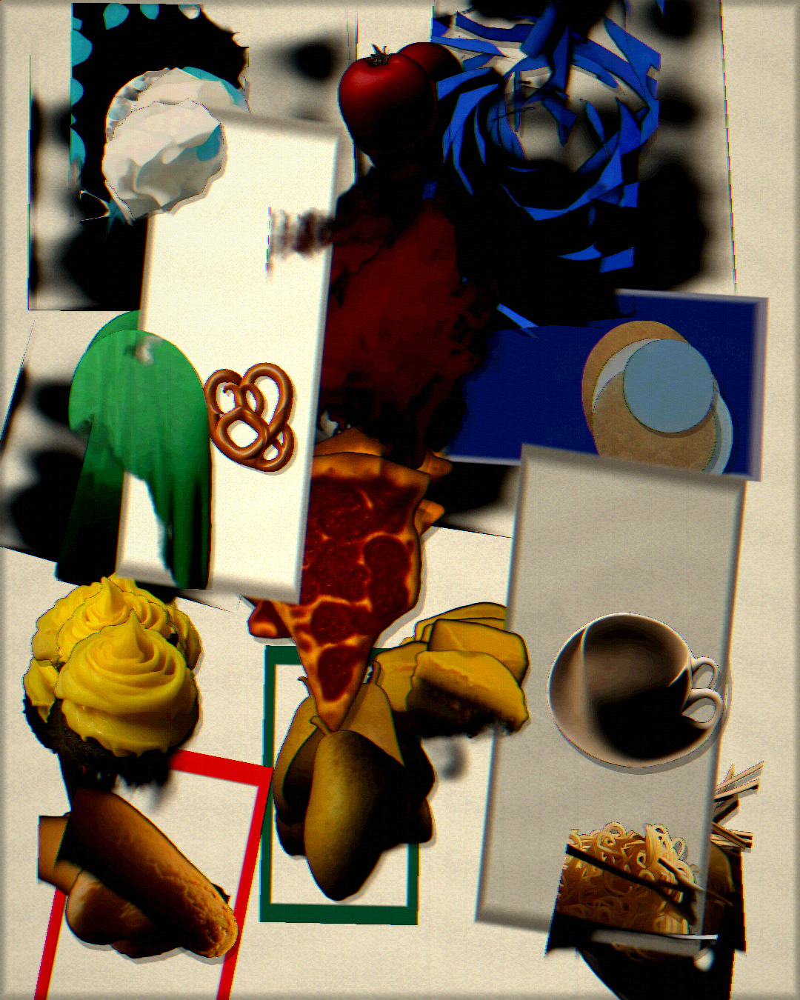

# StreamDiff Collage

StreamDiff Collage is a live poster-making instrument. StreamDiff continuously generates isolated food, paint, paper, and pattern elements; Background Removal cuts each result out; and the Poster Accumulator stamps the finished cutout once into a persistent 1080x1350 canvas. The composition keeps building until **Clear Canvas** is fired.



## What to open

Open `streamdiff_collage.sentinel`. The complete graph is contained by one `STREAMDIFF COLLAGE` Scene Group and ends at one Group Output.

```text
Collage Guide -> Collage Diffusion -> Collage Cutout --\
                         |                              +-> Poster Accumulator -> Collage Output
                         +------------------------------/
```

This is not an Atlas workflow. Each generated result is latched once, placed once, and left in the poster history. A new result never cycles through several cells before settling.

## How the poster evolves

- The prompt bank mixes isolated food subjects with checkerboards, ribbons, paint splotches, arches, and handmade paper shapes.
- **Seconds Per Hit** controls the atomic stamping cadence. `Default` is intentionally fast at 0.1 seconds.
- Each hit chooses a stable position, scale, and rotation and then becomes part of the persistent canvas.
- Graphic frames and large paper rectangles occasionally interrupt the density and create negative space.
- Registration echoes repeat the same cutout along one fixed offset line rather than scattering unrelated copies.
- Halftone, ripped-edge, color, and history-displacement treatments use stable per-hit hashes and deliberately tiny probabilities.
- The final pass adds print contrast, posterization, ink edges, misregistration, grain, shadow, and vignette.

## Scene Group controls

- **Seconds Per Hit** — accumulation speed.
- **Cutout Scale** and **Rotation Chaos** — placement character.
- **Paper Ground** — warm kraft, gallery white, or charcoal.
- **Graphic Frame / Hit** — probability of an outlined structural frame.
- **Negative Space Block / Hit** — probability of a large paper rectangle.
- **Registration Echo / Hit** — probability of an aligned repeated-stamp run.
- **Clear Canvas** — resets the persistent poster.

The remaining rare-event and print controls live on **Poster Accumulator**, with useful ranges authored around the deliberately low working probabilities.

## Presets

The Scene Group ships with six identity-safe presets. `Default` is active in the saved project.

- **Default** — the approved balanced poster setup.
- **Machine Gun** — harder color and print treatment while keeping the rapid cadence.
- **Giant Cuts** — cleaner, larger elements with restrained degradation.
- **Night Press** — denser ink, saturation, and edge treatment.
- **Freeze Frame** — holds generation and accumulation on the current poster.
- **Performance** — a slightly lighter print finish for sustained operation.

Poster Accumulator also carries the project-scoped **Editorial Default** and **Graphic Structure** node presets.

## Engine requirements

The saved graph uses a 512x896 StreamDiff profile and Background Removal. On a fresh machine, inspect `sentinel_app action=engine_status` and install the matching StreamDiff pack plus `auxiliary-birefnet` before loading the example. The authored Collage Guide and Poster Accumulator Modules require no model engines.

## Runtime checks

After the graph settles:

- all five pipelines should report `healthy=true`;
- Collage Diffusion and Collage Cutout should keep processing frames;
- Poster Accumulator should report a 1080x1350 preview;
- recalling each Scene Group preset should apply without skipped pipelines;
- the graph should contain no Atlas, depth, LFO, or 3D renderer nodes;
- the project should report no unresolved Module directories.
